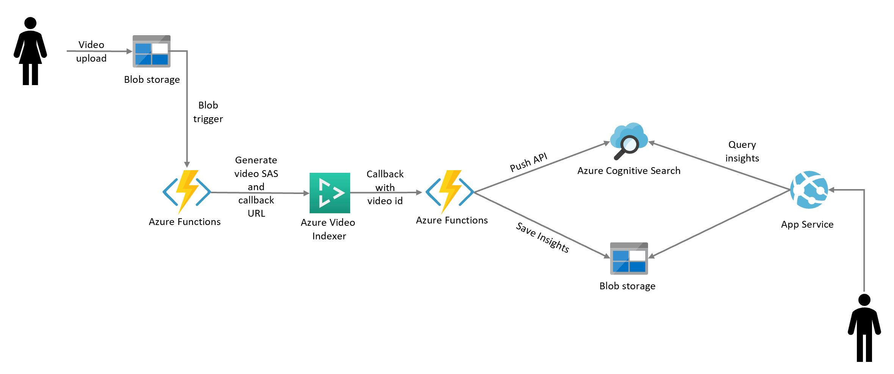

# Azure Cognitive Search - Video Knowledge Mining Extension

## Extend Azure Cognitive Search
Extend [Azure Cognitive Search](https://docs.microsoft.com/azure/search/cognitive-search-concept-intro) capabilities enabling video transcripts and insights search, through an integration with [Azure Video Indexer](https://docs.microsoft.com/en-us/azure/media-services/video-indexer/video-indexer-get-started).

This repo is a collection of two skills:  
* [start-video-indexing](azure-functions/start-video-indexing) (trigger a video indexing starting from a video upload in Azure Blob Storage)  

* [video-indexer-callback](azure-functions/video-indexer-callback) (callback from Azure Blob Storage and push data to Azure Cognitive Search and Azure Blob Storage)

