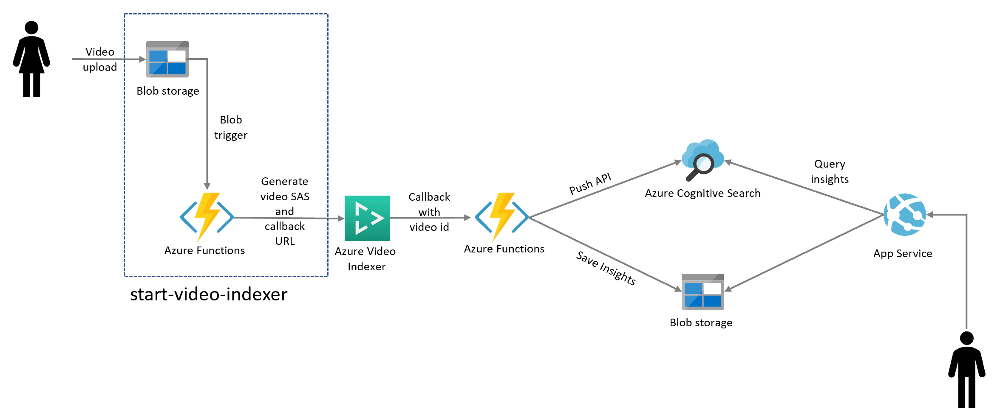
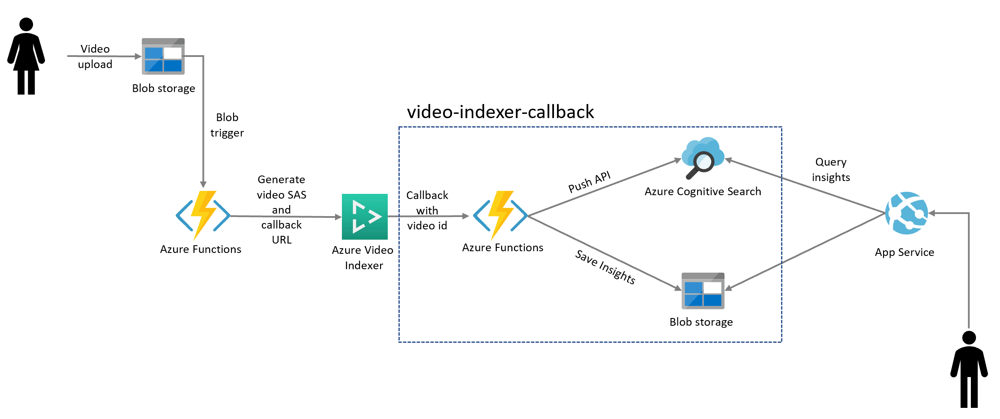

# Azure Cognitive Search - Video Knowledge Mining Extension


# Demo site
[Video Knowledge Mining Demo](https://video-knowledge-mining.azurewebsites.net/)

# Extend Azure Cognitive Search
Extend [Azure Cognitive Search](https://docs.microsoft.com/azure/search/cognitive-search-concept-intro) capabilities enabling video transcripts and insights search, through an integration with [Azure Video Analyzer for Media (formerly Azure Video Indexer)](https://docs.microsoft.com/en-us/azure/azure-video-analyzer/video-analyzer-for-media-docs/video-indexer-get-started).


# Repo Architecture
This repo is a collection of two Azure Functions:  
* [start-video-indexing](azure-functions/start-video-indexing) (trigger a video indexing starting from a video upload in Azure Blob Storage)  


* [video-indexer-callback](azure-functions/video-indexer-callback) (callback from Azure Blob Storage and push data to Azure Cognitive Search and Azure Blob Storage)


and required infrastructure to set up the full end-to-end solution.

# One click Azure Deployment
To deploy the full solution and the Web Application, select the following button:
<br>
<br>
[](https://portal.azure.com/#create/Microsoft.Template/uri/https%3A%2F%2Fraw.githubusercontent.com%2Fruoccofabrizio%2Fazure-search-video-knowledge-mining%2Fmaster%2Finfrastructure%2FARM%2Ftemplate.json)

The Azure portal displays a pane that allows you to easily provide parameter values. The parameters are pre-filled with the default values from the template.

# Available insights in Azure Video Analytics for Media

## Video insights
* __Face detection__: Detects and groups faces appearing in the video.
* __Celebrity identification__: Video Indexer automatically identifies over 1 million celebrities—like world leaders, actors, actresses, athletes, researchers, business, and tech leaders across the globe. The data about these celebrities can also be found on various websites (IMDB, Wikipedia, and so on).
* __Account-based face identification__: Video Indexer trains a model for a specific account. It then recognizes faces in the video based on the trained model. For more information, see Customize a Person model from the Video Indexer website and Customize a Person model with the Video Indexer API.
* __Thumbnail extraction for faces ("best face")__: Automatically identifies the best captured face in each group of faces (based on quality, size, and frontal position) and extracts it as an image asset.
* __Visual text recognition (OCR)__: Extracts text that's visually displayed in the video.
* __Visual content moderation__: Detects adult and/or racy visuals.
* __Labels identification__: Identifies visual objects and actions displayed.
* __Keyframe extraction__: Detects stable keyframes in a video.

## Audio insights
* __Automatic language detection__: Automatically identifies the dominant spoken language. Supported languages include English, Spanish, French, German, Italian, Chinese (Simplified), Japanese, Russian, and Brazilian Portuguese. If the language can't be identified with confidence, Video Indexer assumes the spoken language is English. For more information, see Language identification model.
* __Multi-language speech identification and transcription (preview)__: Automatically identifies the spoken language in different segments from audio. It sends each segment of the media file to be transcribed and then combines the transcription back to one unified transcription. For more information, see Automatically identify and transcribe multi-language content.
* __Audio transcription__: Converts speech to text in 12 languages and allows extensions. Supported languages include English, Spanish, French, German, Italian, Chinese (Simplified), Japanese, Arabic, Russian, Brazilian Portuguese, Hindi, and Korean.
* __Closed captioning__: Creates closed captioning in three formats: VTT, TTML, SRT.
* __Two channel processing__: Auto detects separate transcript and merges to single timeline.
* __Noise reduction__: Clears up telephony audio or noisy recordings (based on Skype filters).
* __Transcript customization (CRIS)__: Trains custom speech to text models to create industry-specific transcripts. For more information, see Customize a Language model from the Video Indexer website and Customize a Language model with the Video Indexer APIs.
* __Speaker enumeration__: Maps and understands which speaker spoke which words and when.
* __Speaker statistics__: Provides statistics for speakers' speech ratios.
* __Textual content moderation__: Detects explicit text in the audio transcript.
* __Audio effects__: Identifies audio effects like hand claps, speech, and silence.
* __Emotion detection__: Identifies emotions based on speech (what's being said) and voice tonality (how it's being said). The emotion could be joy, sadness, anger, or fear.
* __Translation__: Creates translations of the audio transcript to 54 different languages.

## Audio and video insights (multi-channels)
When indexing by one channel, partial result for those models will be available.

* __Keywords extraction__: Extracts keywords from speech and visual text.
* __Named entities extraction__: Extracts brands, locations, and people from speech and visual text via natural language processing (NLP).
* __Topic inference__: Makes inference of main topics from transcripts. The 2nd-level IPTC taxonomy is included.
* __Sentiment analysis__: Identifies positive, negative, and neutral sentiments from speech and visual text.


# OPTIONAL - Web App
NOTE: Web App deployment is automated by the [One click Azure Deployment](#one-click-azure-deployment). Use the following instructions if you want to deploy just the UI and not the full solution.

To deploy a video indexer enabled Knowledge Mining Solution Accelerator Web App, you can pull and run a pre-built docker image providing a
[.env configuration file](#how-to-create-a-env-file) :

```docker
    docker run -d --env-file .env -p 80:80 videokm.azurecr.io/ui:latest
``` 

If you want to personalize the UI, please refer to this [Knowledge Mining Solution Accelerator with Video Indexer](https://github.com/ruoccofabrizio/azure-search-knowledge-mining)

## How to create a .env file
Modify the [.env file](./.env) with your application settings:

### Required fields

```shell
SearchServiceName=
SearchApiKey=
SearchIndexName=
StorageAccountName=
StorageAccountKey=
StorageContainerAddress=https://{storage-account-name}.blob.core.windows.net/{container-name}
KeyField=metadata_storage_path
IsPathBase64Encoded=true
SearchIndexNameVideoIndexerTimeRef=videoinsights-time-references
AVAM_Account_Id=
AVAM_Api_Key=
AVAM_Account_Location=
```

- **SearchServiceName** - The name of your Azure Cognitive Search service
- **SearchApiKey** - The API Key for your Azure Cognitive Search service
- **SearchIndexName** - The name of your Azure Cognitive Search index
- **SearchIndexerName** - The name of your Azure Cognitive Search indexer
- **StorageAccountName** - The name of your Azure Blob Storage Account
- **StorageAccountKey** - The key for your Azure Blob Storage Account
- **StorageContainerAddress** - The URL to the storage container where your - documents are stored. This should be in the following format: *https://- *storageaccountname*.blob.core.windows.net/*containername**
- **KeyField** - They key field for your search index. This should be set to the - field specified as a key document Id in the index. By default this is - *metadata_storage_path*.
- **IsPathBase64Encoded** - By default, metadata_storage_path is the key, and it - gets base64 encoded so this is set to true by default. If your key is not - encoded, set this to false.
- **SearchIndexNameVideoIndexerTimeRef** - The name of your Azure Cognitive - Search time entries index - Leave as the default value if you did not change - it in the infrastructure creation scripts
- **AVAM_Account_Id** - The ID of your Azure Video Analyzer for Media 
- **AVAM_Api_Key** - The API Key of your Azure Video Analyzer for Media 
- **AVAM_Account_Location** - The Location of your Azure Video Analyzer for Media 


### Optional Fields

While some fields are optional, we recommend not removing them from *.env* to avoid any possible errors.

```shell
InstrumentationKey=
StorageContainerAddress2=https://{storage-account-name}.blob.core.windows.net/{container-name}
StorageContainerAddress3=https://{storage-account-name}.blob.core.windows.net/{container-name}
AzureMapsSubscriptionKey=
GraphFacet=keyPhrases, locations
SearchIndexNameVideoIndexerTimeRef=videoinsights-time-references
Customizable=true
OrganizationName=Microsoft
OrganizationLogo=~/images/logo.png
OrganizationWebSiteUrl=https://www.microsoft.com

```

- **InstrumentationKey** - Optional instumentation key for Application Insights. - The instrumentation key connects the web app to Application Inisghts in order - to populate the Power BI reports.
- **StorageContainerAddress2** & **StorageContainerAddress3** - Optional - container addresses if using more than one indexer
- **AzureMapsSubscriptionKey** - You have the option to provide an Azure Maps - account if you would like to display a geographic point in a map in the - document details. The code expects a field called *geolocation* of type Edm.- GeographyPoint.
- **GraphFacet** - The GraphFacet is used for generating the relationship graph. - This can now be edited in the UI.
- **Customizable** - Determines if user is allowed to *customize* the web app. - Customizations include uploading documents and changing the colors/logo of the - web app. **OrganizationName**,  **OrganizationLogo**, and - **OrganizationWebSiteUrl** are additional fields that also allow you to do light customization.
